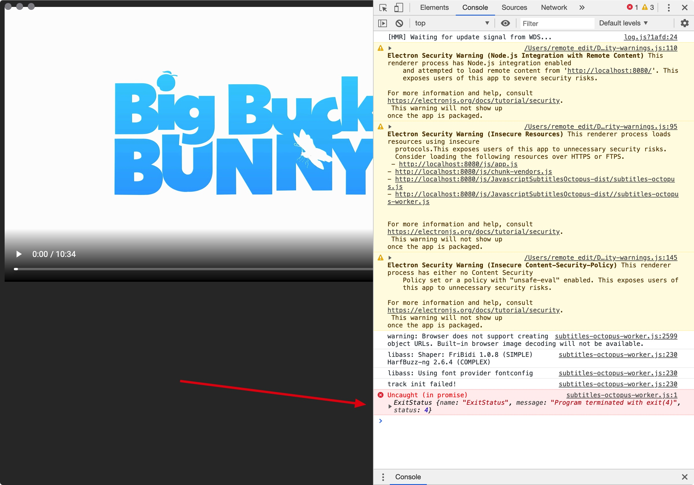

## Demo - Electron.js + JavascriptSubtitlesOctopus
2020-1-16
* Electron.js 6.1.5
* JavascriptSubtitlesOctopus 3.0.2

## Help debug:  

https://github.com/Dador/JavascriptSubtitlesOctopus/issues/60


## Setup
```
git clone https://github.com/1c7/Electron-JavascriptSubtitlesOctopus.git
cd Electron-JavascriptSubtitlesOctopus/
npm install
npm run dev
```

## Error


```
Uncaught (in promise) 
message: "Program terminated with exit(4)"
name: "ExitStatus"
status: 4
```